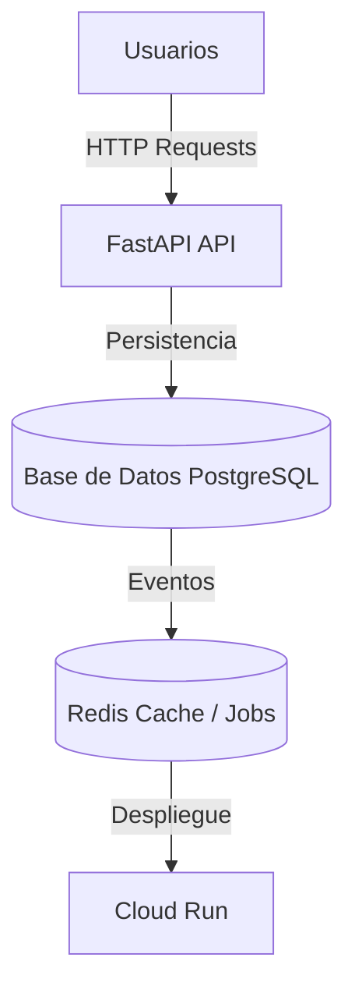

# Arquitectura del Sistema

```mermaid
flowchart TB
    Users[Usuarios]
    API[FastAPI API]
    DB[(Base de Datos PostgreSQL)]
    Redis[(Redis Cache / Jobs)]
    CloudRun[Cloud Run]

    Users -->|HTTP Requests| API
    API -->|Persistencia| DB
    DB -->|Eventos| Redis
    Redis -->|Despliegue| CloudRun
```
